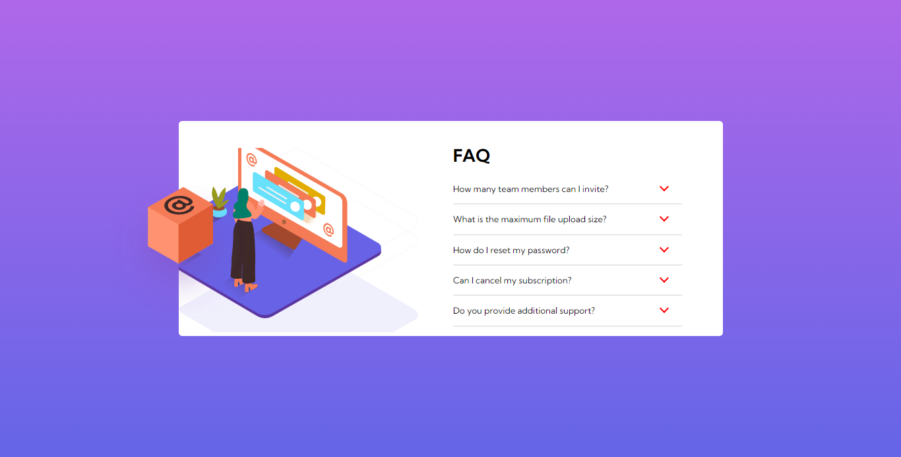

# Frontend Mentor - FAQ accordion card solution

This is a solution to the [FAQ accordion card challenge on Frontend Mentor](https://www.frontendmentor.io/challenges/faq-accordion-card-XlyjD0Oam). Frontend Mentor challenges help you improve your coding skills by building realistic projects.

## Table of contents

- [Overview](#overview)
  - [The challenge](#the-challenge)
  - [Screenshot](#screenshot)
  - [Links](#links)
  - [Built with](#built-with)
  - [What I learned](#what-i-learned)
- [Author](#author)

**Note: Delete this note and update the table of contents based on what sections you keep.**

## Overview

### The challenge

Users should be able to:

- View the optimal layout for the component depending on their device's screen size
- See hover states for all interactive elements on the page
- Hide/Show the answer to a question when the question is clicked

### Screenshot



### Links

- Live Site URL: [Live site](https://faq-accordion-by-chizoba.netlify.app/)

### Built with

- Semantic HTML5 markup
- CSS custom properties
- Flexbox
  -Desktop first workflow

### What I learned

I learned how to use the .nextElementSibling to manipulate the DOM. Below is a snippet of code I am proud of in this project.

```js
mainPs.forEach((mainP) => {
  mainP.addEventListener('click', () => {
    mainP.classList.toggle('active')
    mainP.nextElementSibling.classList.toggle('active')
  })
```

## Author

- Frontend Mentor - [@chizoba-009](https://www.frontendmentor.io/profile/chizoba-009)
- Twitter - [@EmeghieboC](https://www.twitter.com/EmeghieboC)
